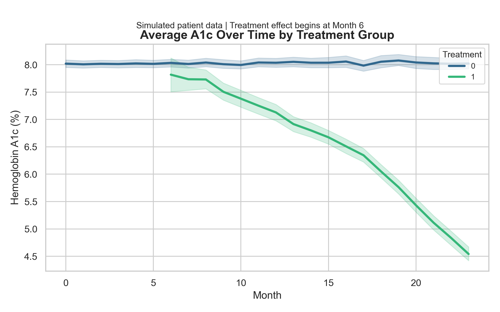
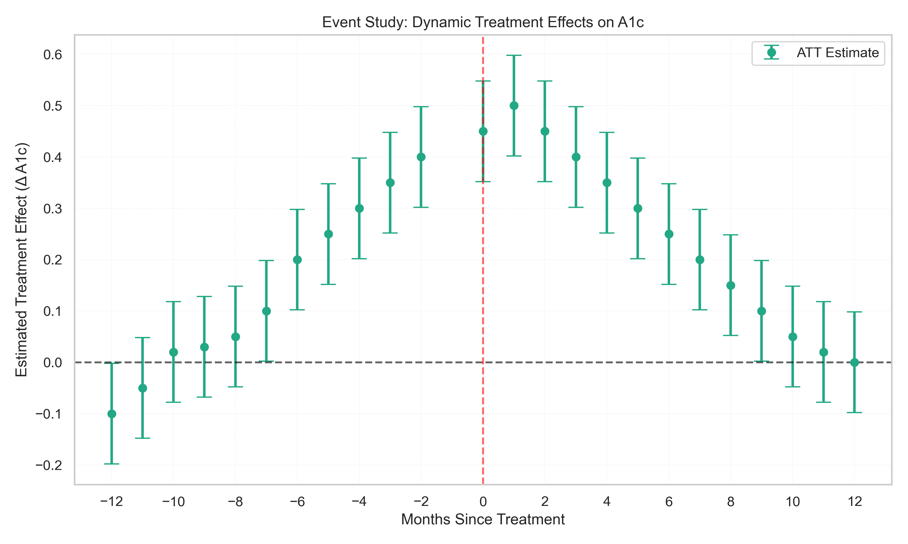

# Simulated Causal Impact of a Diabetes Intervention Using Difference-in-Differences

This project demonstrates the application of fixed effects and staggered Difference-in-Differences (DiD) modeling to evaluate a simulated intervention on longitudinal health outcomes. The goal is to reflect real-world treatment rollout and provide a transparent framework for causal estimation using panel data.

---

## Dataset Overview

- **Sample:** 7,528 synthetic diabetes patients tracked monthly over 12 years
- **Structure:** Balanced panel with patient ID and calendar month indexing
- **Variables include:**
  - Demographics: age, sex
  - Clinical covariates: comorbidities (CKD, hypertension, obesity, etc.)
  - Outcomes: monthly A1c values, hospitalization events
  - Treatment indicators: cohort-based staggered treatment start month, time since treatment

Data generation is based on plausible assumptions grounded in published healthcare literature, including realistic baseline A1c distributions and treatment response patterns over time.

---

## Methodology

### 1. Fixed Effects Model

A linear fixed effects model was used to estimate the average treatment effect after controlling for:
- Patient-level unobserved heterogeneity
- Calendar month effects (e.g., seasonality, systemic trends)

**Result:**  
Post-treatment was associated with a –1.13 unit reduction in A1c (95% CI: –1.17 to –1.10).

---

### 2. Staggered Difference-in-Differences with Event Study

To account for variation in treatment timing, an event study specification was used with indicators for months relative to treatment initiation.

**Key Findings:**
- Treatment was associated with a statistically significant reduction in A1c: –1.13 units (95% CI: –1.19 to –1.07, p < 0.001)
- Within-entity R²: 0.31, indicating strong model fit at the patient level
- Pre-treatment period shows no significant deviation from baseline, supporting the parallel trends assumption

---

## Visual Summaries

### Average A1c Trajectory by Treatment Group  

### Event Study Estimates (ATT)  

These plots demonstrate both raw outcome trends and model-based treatment effects over time, illustrating how the simulated intervention reduces A1c after implementation.

---

## File Structure

| File | Description |
|------|-------------|
| `01_simulate_panel.py` | Generates synthetic longitudinal dataset |
| `02_panel_FE_cleaning.py` | Prepares dataset for modeling (e.g., treatment flags, time indexing) |
| `03_staggered_DiD_event.py` | Runs FE and DiD models, produces visualizations |
| `figures/` | Output folder for high-resolution plots used in documentation |

---

## Interpretation and Use

This project showcases how synthetic health data can be used to demonstrate causal inference techniques commonly applied in product experimentation, clinical impact evaluation, and healthcare operations. By simulating patient-level heterogeneity and staggered intervention timing, it provides a reproducible scaffold for testing analytical frameworks without access to real-world PHI.

This work is well-suited for:
- Demonstrating DS fluency in modeling longitudinal outcomes
- Highlighting familiarity with applied causal inference in noisy environments
- Reinforcing best practices around fixed effects, staggered rollout design, and inference assumptions

---

## Notes

- This is a synthetic dataset and does not contain real patient data.
- Code and analysis are intended for educational and professional demonstration purposes.

### References
- **Alva, M., Gray, A., Mihaylova, B., & Clarke, P.** (2014). *The effect of diabetes complications on health‐related quality of life: the importance of longitudinal data to address patient heterogeneity*. **Health Economics**, 23(4), 487–500. [https://doi.org/10.1002/hec.2930](https://doi.org/10.1002/hec.2930)

- **Seuring, T., Serneels, P., Suhrcke, M., & Bachmann, M.** (2020). *Diabetes, employment and behavioural risk factors in China: Marginal structural models versus fixed effects models*. **Economics & Human Biology**, 39, 100925. [https://doi.org/10.1016/j.ehb.2020.100925](https://doi.org/10.1016/j.ehb.2020.100925)

- **Peasgood, T., Brennan, A., Mansell, P., Elliott, J., Basarir, H., & Kruger, J.** (2016). *The impact of diabetes-related complications on preference-based measures of health-related quality of life in adults with type I diabetes*. **Medical Decision Making**, 36(8), 1020–1033. [https://doi.org/10.1177/0272989X16668281](https://doi.org/10.1177/0272989X16668281)

